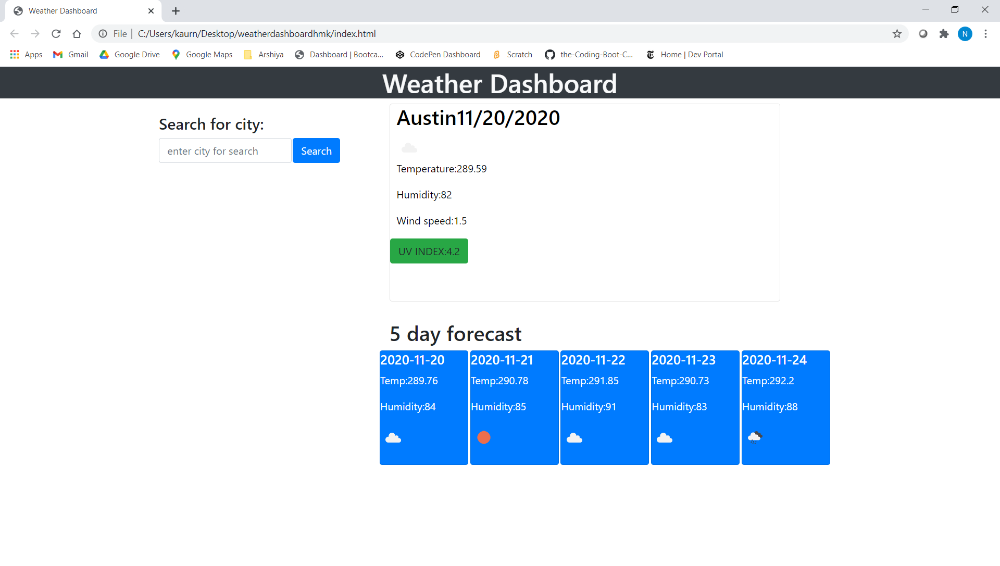

# About Assignment:-
I have made **Weather Dashboard** with the use of **API KEY**.

IT shows the **weather** of **entered city** with the **Five Day Forecast**.

# Description:-
**Weather Dashboard** which shows the weaather of entered city with **Five Day Forecast**. And the entered city stores in array in **local Storage**.If the user,entered the city name again , **definately** user can see the weather again, but the name of city stored at the end of array in local storage. So, It means that the most recent search goes at the **end** of array. I have the oppurtunity to work with the **API Key** .This was challenging, big thanks to my **Instructor**
**CALVIN CARTER** . As I ,undestand some parts in a very good way.

   

## Text Editor:-

**Vs code**

## Language used :-

**HTML**

**CSS**

**Jquery**

**Javascript**

 **Bootstrap**

## Resouces Reffered:-

[Open-Weather-Documentation](https://openweathermap.org/api)

[Open-Weather-documentation-icons](https://openweathermap.org/weather-conditions)

[Moment.js](https://momentjs.com/)

[W3Schools](https://www.w3schools.com/jsref/jsref_substr.asp)

[Bootstrap](https://getbootstrap.com/docs/4.0/components/buttons/)

### Screensshots

## Links
[Github Repository](https://github.com/nehreetkaur/weatherdashboardhmk)

[Github Deployed Application](https://nehreetkaur.github.io/weatherdashboardhmk/)